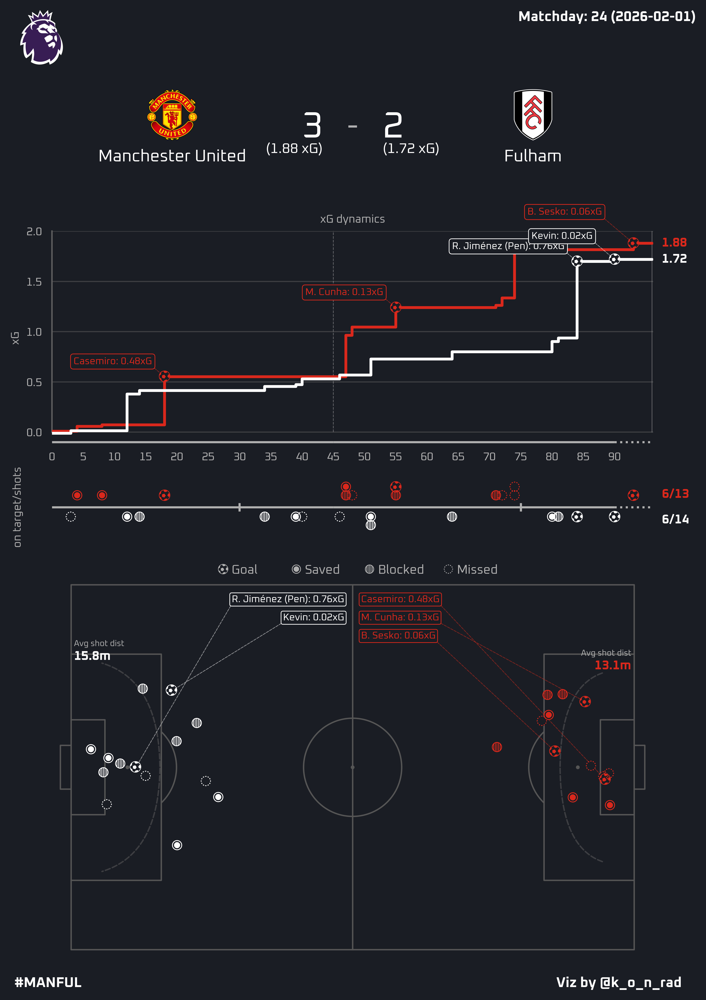
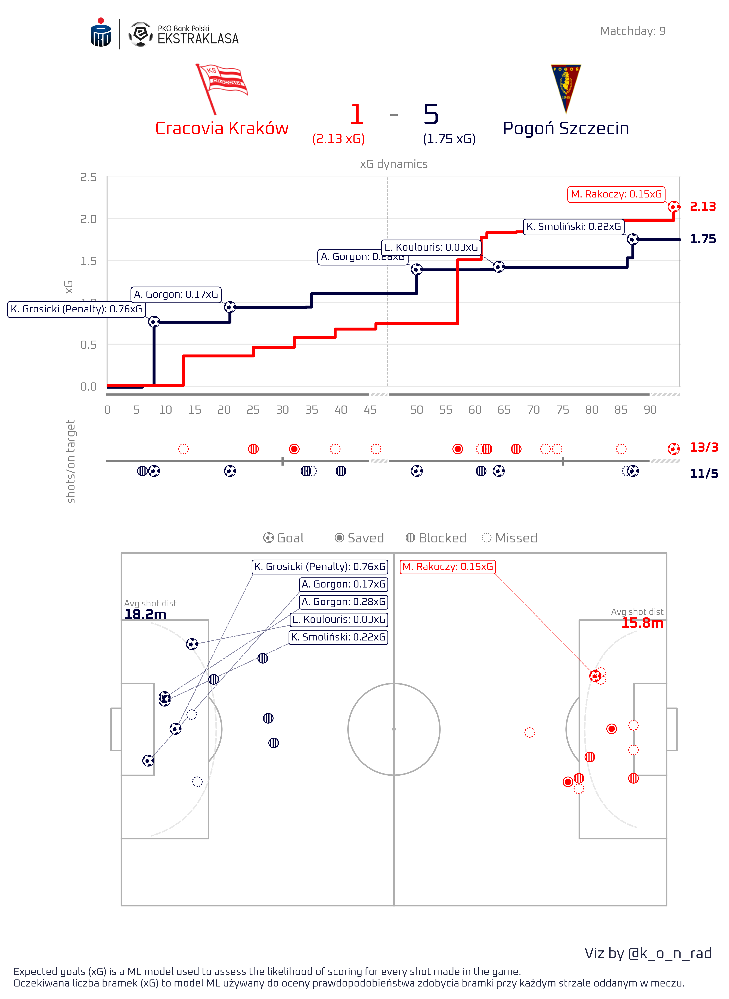
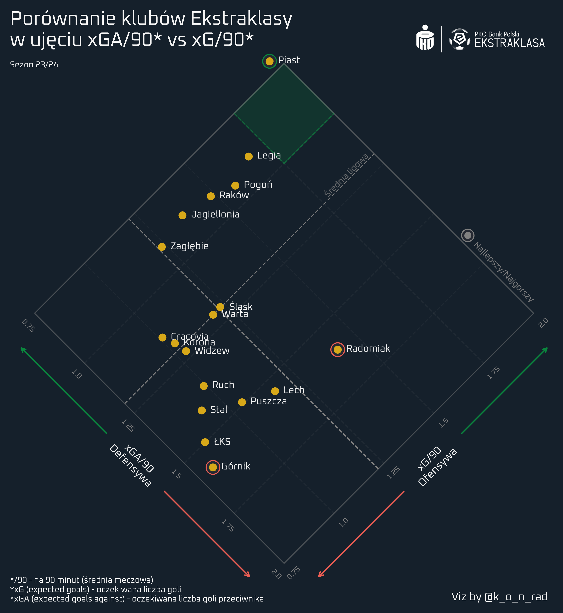
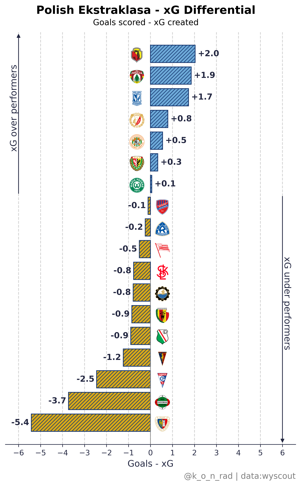
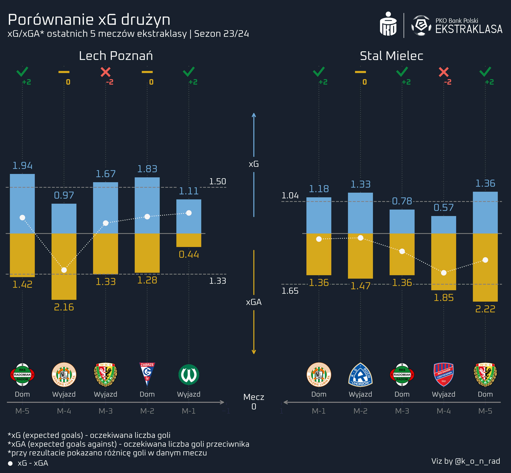
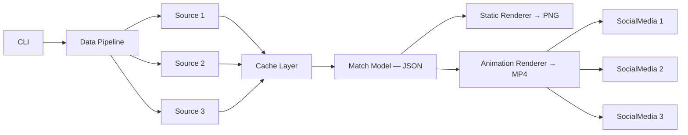

  

<h1 align="center">FCAI - Football Chart & Analysis Insights</h1>

  <em>Automated football match visualizations powered by xG data</em>

---

## About

FCAI generates professional match report infographics from a single CLI command. It pulls data from multiple APIs, processes it through a caching pipeline, and renders publication-ready visuals.

- **Format**: 1080x1920px (Instagram Story, 9:16 aspect ratio)
- **Output**: Static reports (PNG) and animated reports (MP4 with audio)
- **Data**: xG values, shot positions, injury time, team logos — all fetched and merged automatically

---

## Gallery

### Match Reports

<table>
  <tr>
    <td align="center"><strong>EPL (Dark Theme)</strong></td>
    <td align="center"><strong>Ekstraklasa (Light Theme)</strong></td>
  </tr>
  <tr>
    <td></td>
    <td></td>
  </tr>
</table>

### Animation

<table>
  <tr>
    <td align="center" width="400">
      <a href="assets/match-animation.mp4">
        
         
        <strong>Watch animation (MP4)</strong>
      </a>
    </td>
    <td>
      <strong>75-second animated match report</strong>
        
      <ul>
        <li>Progressive shot-by-shot build at 30fps</li>
        <li>1.2s pause on each goal with audio cue</li>
        <li>Background music with automatic ducking</li>
        <li>Hook intro + crossfade + outro scenes</li>
        <li>H.264 codec, Instagram-ready</li>
      </ul>
    </td>
  </tr>
</table>

### League Analytics

<table>
  <tr>
    <td align="center"><strong>xGA vs xG Diamond</strong></td>
    <td align="center"><strong>xG Differential</strong></td>
  </tr>
  <tr>
    <td></td>
    <td></td>
  </tr>
</table>

### Pre-match

  

---

## Features

- **Multi-source data pipeline** — 3 APIs with caching, rate limiting, and automatic retry
- **Fuzzy name matching** — resolves team name discrepancies between different data providers
- **Delta E CIE2000 color contrast** — automatically picks contrasting team colors for readability
- **Injury time handling** — splits added time per half for accurate timeline positioning
- **Animated reports** — 30fps video with goal pauses and audio with ducking
- **Dark & light themes** — optimized color palettes per theme
- **600 DPI output** — publication-quality, Instagram-ready format

---

## Architecture

---

## Tech Stack

| Category | Libraries |
|----------|-----------|
| **Visualization** | matplotlib, mplsoccer, Pillow |
| **Data** | pandas, numpy |
| **Animation** | moviepy (H.264) |
| **CLI** | click, rich |
| **Networking** | tenacity (retry), requests |
| **Color Science** | colormath (Delta E CIE2000) |

---

## Roadmap

- [x] Match report (PNG)
- [x] Animated report (MP4 with audio)
- [x] Dark & light themes
- [x] Multi-league support
- [ ] Round summary (automated xG diamond chart)
- [ ] European competitions (UCL, UEL, UECL)
- [ ] More leagues (La Liga, Bundesliga, Serie A, Ligue 1)
- [ ] Social media publication

---

  <strong>@k_o_n_rad</strong>
   
  Source code is private. This repository showcases outputs only.

